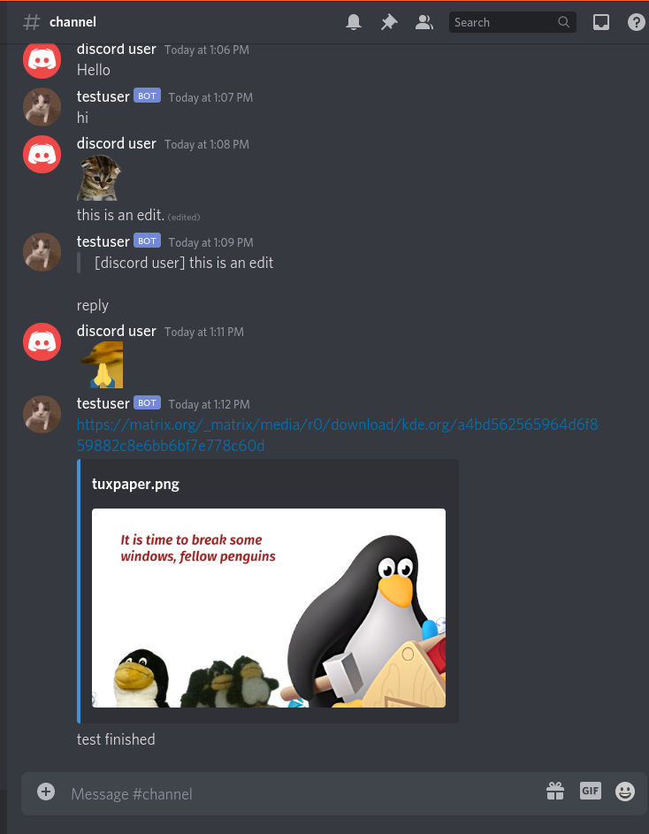

# matrix-discord-bridge

A simple non-puppeting bridge between Matrix and Discord written in Python.

## Installation

`pip install -r requirements.txt`

## Usage

* Run `main.py` to generate `config.json`

* Edit `config.json`

* Normal Discord bot functionality like commands can be added to the bot via [cogs](https://discordpy.readthedocs.io/en/latest/ext/commands/cogs.html), example [here](https://gist.github.com/EvieePy/d78c061a4798ae81be9825468fe146be).

* Apply `use_client_emojis.patch` to make the Discord bot use emojis from all it's servers.

NOTE: [Privileged Intents](https://discordpy.readthedocs.io/en/latest/intents.html#privileged-intents) must be enabled for your Discord bot.

## Screenshots

## What Works

- [x] Sending messages
- [x] Discord webhooks (with avatars)
- [x] Attachments (Converted to URLs)
- [x] Typing status (Not very accurate)
- [x] Redacting messages
- [x] Editing messages
- [x] Replies
- [x] Bridging multiple channels/rooms
- [x] Discord emotes bridged as inline images (Works on Element Web, Fluffychat)
