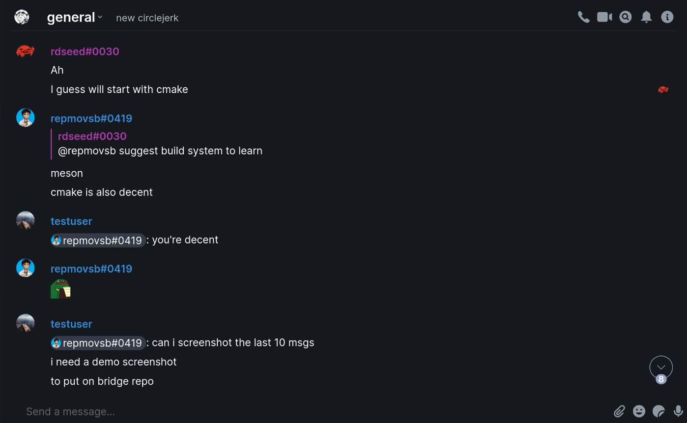

# matrix-discord-bridge

A simple bridge between Matrix and Discord written in Python.

This repository contains two bridges:

* A [puppeting appservice](appservice): The puppeting bridge written with minimal dependencies. Running this requires a self-hosted homeserver.

* A [non-puppeting bridge](bridge): The non-puppeting plaintext bridge written with `matrix-nio` and `discord.py`, most people would want to use this one if running on heroku or similar and don't have their own server. **NOTE:** This is unmaintained and might break in the future due to Discord changes.

Check their READMEs for specific information.

## What Works

- [x] Puppeting (Appservice only, regular bridge only uses webhooks on Discord.)
- [x] Attachments (Converted to URLs.)
- [x] Typing Indicators (Per-user indicators on Appservice, otherwise sent as bot user.)
- [x] Message redaction
- [x] Replies
- [x] Bridging multiple channels
- [x] Discord emojis displayed as inline images
- [x] Sending Discord emotes from Matrix (`:emote_name:`)
- [x] Mentioning Discord users via partial username (`@partialname`)

## TODO

- [ ] Handle cases where the webhook is messed with on the Discord side (Deleted/Edited by someone other than the bot).
- [ ] Use embeds on Discord side for replies.
- [ ] Unbridging.
